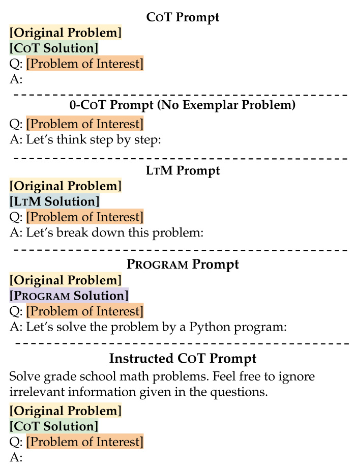

# 大型语言模型容易受到无关上下文的干扰

# 摘要

大型语言模型（LLMs）已在各种自然语言处理任务中展现出卓越的性能。然而，目前的评估主要集中在那些输入上下文中所有信息都与解决任务直接相关的基准测试上。本文旨在探究大型语言模型的**抗干扰能力**，即模型在解决问题时的准确性如何受到无关上下文信息的影响。为此，我们构建了 **GSM-IC（带无关上下文的小学数学题）**数据集，这是一个在问题描述中融入了无关信息的算术推理数据集。我们利用 GSM-IC 来评估当前先进的大型语言模型提示技术的抗干扰性，结果表明，当问题中包含无关信息时，模型的性能会显著降低。此外，我们还探索了几种缓解这种性能下降的方法，例如采用**自洽性解码**，以及在提示中加入明确指令，引导语言模型忽略无关信息。

---

# 示例：GSM-IC 问题示例

为了更直观地展示，请看下面 GSM-IC 数据集中的一个例子：

| 类型                 | 问题描述                                                                                                                            |
| :------------------- | :---------------------------------------------------------------------------------------------------------------------------------- |
| **原始问题**   | 杰西卡比克莱尔大六岁。两年后，克莱尔将满 20 岁。杰西卡现在多大？                                                                    |
| **修改后问题** | 杰西卡比克莱尔大六岁。两年后，克莱尔将满 20 岁。_`<u>`二十年前，克莱尔父亲的年龄是杰西卡年龄的 3 倍。`</u>`_ 杰西卡现在多大？ |
| **标准答案**   | 24                                                                                                                                  |

**表 1.** GSM-IC 示例问题。在原问题提问之前，添加了一句无关信息（用斜体和下划线标出），这句话并不影响问题的标准答案。

---

在现实场景中，问题往往伴随大量的背景信息，其中一部分可能与待解决问题相关，另一部分则无关。因此，在解决实际问题时，识别哪些信息是关键的，哪些是干扰项至关重要。心理学研究表明，无关信息会显著降低儿童甚至成年人在解决问题时的准确率（Hoyer et al., 1979; Pasolunghi et al., 1999; Marzocchi et al., 2002 等）。

# 1. 引言

通过提示技术引导大型语言模型，已在多个领域取得了令人瞩目的成果（Brown et al., 2020; Chowdhery et al., 2022 等）。然而，现有评估基准大多是为模型提供完全相关的上下文信息，这与考试题目的设定类似。**真实世界的问题**则往往更加复杂，包含各种各样的上下文，其中可能混杂着与解题目标无关的信息。

本文旨在研究不同提示技术下大型语言模型的**抗干扰能力**，即无关上下文对大型语言模型提示效果的具体影响，以及提升模型抗干扰性的策略。为了量化模型的抗干扰性，我们构建了 **GSM-IC 数据集**。该数据集基于 GSM8K（Cobbe et al., 2021）小学数学题库，并在此基础上引入了两种评估指标。与以往通过改写或替换原问题语句来构建变体基准的方法（Patel et al., 2021; Kumar et al., 2021 等）不同，我们**保留了原问题的完整描述，仅额外添加一句无关信息，并确保该信息的加入不影响原问题的解答**（如表 1 所示）。

我们采用 GPT-3 系列模型中的 **Codex (code-davinci-002)** 和 **GPT-3.5 (text-davinci-003)**，在 GSM-IC 数据集上评估了当前主流的提示技术²，包括：

* **思维链提示 (COT)** (Wei et al., 2022)
* **零样本思维链提示 (0-COT)** (Kojima et al., 2022)
* **由简入繁提示 (LTM)** (Zhou et al., 2022)
* **程序提示 (PROGRAM)** (Chowdhery et al., 2022)

实验结果表明，与在原始 GSM8K 数据集（无无关上下文）上的表现相比，这些提示技术在 GSM-IC 数据集上的性能均出现**显著下降**。

随后，我们探究了几种缓解模型抗干扰性的方法，包括：

* **自洽性 (Self-consistency)** (Wang et al., 2022c)
* 在提示的**示例中加入无关信息**

除了通过示例展示如何处理无关信息外，我们还探究了**任务特定指令** (Wei et al., 2021; Sanh et al., 2021; Ouyang et al., 2022; Suzgun et al., 2022; Chung et al., 2022) 的作用。具体而言，我们在提示示例前添加指令：“**请忽略问题描述中的无关信息**”。

我们的主要发现如下：

1. **当前探究的所有提示技术都容易受到问题描述中无关信息的干扰**。具体而言，对于基线提示原本可以通过贪婪解码解决的问题，在引入各类无关信息后，能够被**持续**正确解答（即对所有类型的无关信息均能正确作答）的比例**不足 18%**。这表明，大型语言模型极易受到干扰，即使问题描述中仅增加少量无关信息，模型的预测结果也变得很不稳定。
2. **自洽性 (Self-consistency) 有效提升了所有提示技术在 GSM-IC 数据集上的性能**。特别地，当每个问题生成 20 个解答样本时，GSM-IC 数据集上正确答案的召回率高达 **99.7%**，这意味着 20 个解答中，几乎总能找到至少一个正确答案。因此，通过生成多个样本，模型几乎总能“找回”正确的解题思路。
3. **在提示的示例中加入无关信息**，或**添加忽略无关上下文的指令**，均能持续提升模型性能。这表明，语言模型在一定程度上可以通过学习示例或遵循指令来学会识别并忽略无关信息。
4. 我们进一步分析了影响模型对无关上下文敏感度的**多种因素**。细致的分析表明，无关信息中**数值大小的变化**对模型性能影响不大，而无关信息与原问题描述的**词汇重叠程度**则对模型性能至关重要。

在实际应用中，过滤无关信息对于有效解决问题至关重要。我们的评估结果表明，尽管当前先进的语言模型在解决复杂推理问题方面表现出色，但在**上下文理解**和**从输入中识别相关信息**方面仍然存在根本性缺陷。为了更全面地评估语言模型的推理能力，未来的研究方向应同时关注模型在解决复杂难题和应对无关信息干扰时的表现。

# 2. 相关工作

**少样本提示技术**：少样本提示 (Brown et al., 2020; Chowdhery et al., 2022 等) 借助多种技术得到了显著增强，这些技术包括：生成中间步骤 (Ling et al., 2017; Cobbe et al., 2021; Nye et al., 2021; Wei et al., 2022; Suzgun et al., 2022; Shi et al., 2022b 等)、问题分解 (Zhou et al., 2022; Drozdov et al., 2022; Dohan et al., 2022; Khot et al., 2022; Press et al., 2022 等)、生成程序 (Austin et al., 2021; Chowdhery et al., 2022; Gao et al., 2022; Chen et al., 2022 等)、边缘化处理共享相同结果的中间步骤 (Wang et al., 2022c; Shi et al., 2022a) 以及集成方法 (Wang et al., 2022b; Drozdov et al., 2022)。此外，Kojima et al. (2022) 的研究表明，即使不提供任何示例，仅在提示中加入合适的提示语也能获得良好的性能。本文探究了这些前沿的提示技术 (Wei et al., 2022; Zhou et al., 2022; Kojima et al., 2022; Wang et al., 2022c) 在我们构建的基准数据集上的表现，并证实了它们对无关输入上下文的敏感性。

**带输入扰动的自然语言基准**：在自然语言处理任务中引入输入扰动已成为一个重要的研究方向，相关的研究包括与模型无关的输入转换方法 (Liang et al., 2022; Ravichander et al., 2022 等) 以及针对特定模型的对抗样本生成方法 (Jia & Liang, 2017; Shi et al., 2018; Morris et al., 2020; Wang et al., 2021)。特别地，早期的研究工作致力于通过**复述或重写**原始数据集中的问题语句来构建算术推理基准数据集 (Patel et al., 2021; Kumar et al., 2021)。与此同时，Liang et al. (2022) 在准确性、鲁棒性和公平性等多个指标上评估了各种大型语言模型。具体来说，他们在鲁棒性评估中使用的输入转换方法包括语义保留和语义改变两种类型的扰动，例如注入拼写错误、修改语句以改变标准分类标签等。与上述研究工作中可能改变问题描述语义的方法不同，我们**保留了原始问题描述中的所有语句，并引入了一句与解题无关的句子，且确保该句子的加入不影响问题的标准答案**。

**带无关输入上下文的自然语言基准**：Jia & Liang (2017) 的研究表明，神经问答系统极易受到**对抗性干扰句**的影响。后续研究 (Khashabi et al., 2017; Ni et al., 2019) 提出了一些学习策略来缓解这一问题。通用预训练语言模型在事实推理 (Kassner & Schutze, 2020; Pandia & Ettinger, 2021; Misra et al., 2023; Li et al., 2022)、代码生成 (Jones & Steinhardt, 2022) 和句法泛化 (Chaves & Richter, 2021) 等任务中也发现了类似的问题。特别地，Li et al. (2022) 使用少样本提示评估了 T5 (Raffel et al., 2020) 和 PaLM (Chowdhery et al., 2022) 模型，并提出了一种**知识增强的微调**方法，该方法在包含反事实和无关上下文的问题上对模型进行微调，从而提升模型对噪声上下文的鲁棒性。在我们的评估中，我们证明了，**无需任何训练或微调**，仅需在提示的演示示例中加入无关上下文，就能有效减轻底层语言模型的干扰，并显著提升模型在 GSM-IC 基准数据集上的性能。

目前已有一些逻辑推理基准数据集在任务描述中包含了无关内容 (Weston et al., 2015; Sinha et al., 2019; Clark et al., 2021; Han et al., 2022; Tafjord et al., 2020 等)。然而，以往的研究工作主要集中于设计需要额外训练的模型。对于这些任务，**仅使用提示技术仍然很难达到与微调模型相当的性能水平** (Han et al., 2022; Creswell et al., 2022)。本文聚焦于**算术推理**领域，提示技术已在该领域取得了最先进的成果，例如在 GSM8K 数据集上。然而，我们的研究表明，即使**仅在问题描述中添加一个无关语句，也会显著降低模型性能**。

**带噪声基准答案的提示**：一系列研究探究了模型在使用**不正确**的提示示例（即示例问题与错误答案配对）时的性能 (Min et al., 2022; Kim et al., 2022)。此外，早期的研究工作还探究了模型对提示其他部分的敏感性，例如使用误导性和无关指令进行指令调优 (Webson & Pavlick, 2021)，以及在示例中使用错误的推理步骤 (Madaan & Yazdanbakhsh, 2022; Wang et al., 2022a)。特别是，Madaan & Yazdanbakhsh (2022) 得出结论，思维链提示中数字和等式本身的正确性对模型性能并非至关重要，但如果在推理步骤中使用了错误的实体，或移除等式或文本解释，则会**严重**损害模型性能。与上述研究工作不同，我们始终在提示中为示例问题提供正确的答案，并确保添加到问题描述中的无关上下文**不影响问题的标准答案**。我们的研究表明，当问题描述中出现无关上下文时，模型性能会显著下降；并且，无关上下文中数字和实体的不同分布也会导致不同程度的性能下降。

# 3. GSM-IC 数据集

本节将介绍 GSM-IC 数据集的构建过程 (§3.1) 以及评估指标 (§3.2)。

# 3.1. 数据集构建

我们从 GSM8K 训练集中随机抽取了 1,000 个问题作为开发集。为了构建基础数据集，我们从开发集中进一步筛选出 100 个问题，这些问题能够被本文探究的至少一种提示技术正确解答³。也就是说，我们的基础数据集是 GSM8K 数据集中相对容易的一个子集（见表 2）。每个基础问题需要两到七个推理步骤才能解决⁴。在这 100 个基础问题中，有 60 个仅需两个推理步骤即可解决。完整的数据集统计信息请参见附录 A。

| 提示技术     | code-davinci-002 准确率 (%) |
| :----------- | :-------------------------- |
| COT          | 95.0                        |
| LTM          | 94.0                        |
| PROGRAM      | 83.0                        |
| 0-COT        | 44.0                        |
| COT + SC     | 96.0                        |
| LTM + SC     | 99.0                        |
| PROGRAM + SC | 91.0                        |
| 0-COT + SC   | 76.0                        |

**表 2.**  `code-davinci-002` 模型在包含 100 个样本的基础数据集上的准确率 ($\times 100$)。使用 `text-davinci-003` 模型的结果见原论文表 3。SC 表示自洽性 (Self-Consistency)。

接下来，我们通过为每个基础问题添加一句包含无关信息的句子，来生成新数据集的样本。我们采用基于模板的方法（如图 1 所示）来生成这些句子。生成的句子主要由以下三个因素控制：

* **插入句子的主题**：我们为**同主题**和**异主题**的句子都设计了模板。同主题的句子与原问题的核心话题密切相关，而异主题的句子则与原问题话题无关。
* **角色名称重叠**：大多数句子模板包含一些角色名称的空白，这些空白可以填充与原问题角色名称相同或不同的名称。对于与原问题角色名称存在重叠的情况，我们的操作步骤如下：（1）从原问题描述中随机选择一个角色名称 A；（2）使用“A 的父亲”、“A 的姐妹”等模板来生成填充词。
* **数值范围**：由于本文关注算术推理，因此大多数句子模板也包含一个数值空白。我们可以选择用与原问题数值**量级相近**或 **量级差异较大**的数字来填充该空白。具体而言，对于一个数值 $a$，如果原问题描述或答案中存在一个数值 $b$ 满足 $\frac{1}{10} \leq \frac{a}{b} \leq 10$，则我们认为 $a$ 是一个**同量级**数值，否则为**异量级**数值。考虑到 GSM8K 问题的标准答案均为正整数，我们仅使用正整数填充数值空白。

**图 1. GSM-IC 数据集构建因素示例**

```
原始问题：
珍妮想玩摩天轮、过山车和碰碰车。摩天轮 5 张票，过山车 4 张票，碰碰车 4 张票。珍妮有 5 张票。[无关句子] 珍妮还需要买几张票？

无关句子选项：

主题：
  同主题：[角色] 每天骑 [数字] 公里到公交车站。
  异主题：[角色] 的鞋码是 [数字] 码。

[角色] 选项：（与原问题角色词汇是否重叠？）
  是：珍妮的父亲、珍妮的姐姐、珍妮的邻居...
  否：艾达、杰克、玛丽、汤姆...

[数字] 选项：（数值范围是否与原问题相近？）
  同量级：5, 6, 7, 8...
  异量级：100, 1000, 5000...
```

*（注：上图为原文 Figure 1 的文字化转述和翻译，以便理解。更详细的说明请参考原论文的彩色图示。）*

我们人工验证了以下两点：（1）所有生成的句子在语法上均符合英语表达习惯；（2）添加这些句子不会影响原问题的标准答案。由于上述三个因素是相互独立的，因此我们可以为每个基础样本生成一组具有不同因素组合的衍生样本。最终，GSM-IC 基准数据集共包含 58,052 个样本。关于数据集构建过程的更多细节，请参见附录 A。

# 3.2. 评估指标

对于问题 $p$，我们用 $s(p)$ 表示其标准答案，用 $\mathcal{M}(p)$ 表示模型 $\mathcal{M}$ 给出的答案。为了评估模型 $\mathcal{M}$ 的抗干扰能力，我们采用了以下两个评估指标：

* **微观准确率 (Micro accuracy)** $Acc_{micro}(\mathcal{M};\mathcal{P})$：模型 $\mathcal{M}$ 在所有测试问题 $\mathcal{P}$ 上的平均准确率。

  $$
  Acc_{micro}(\mathcal{M};\mathcal{P})=\frac{\sum_{p\in\mathcal{P}}\mathbb{1}\left[\mathcal{M}(p)=s(p)\right]}{|\mathcal{P}|}
  $$

  微观准确率平等地衡量每一个测试样本的准确性。
* **宏观准确率 (Macro accuracy)** $Acc_{macro}({\mathcal{M}};\mathcal{B})$：模型 $\mathcal{M}$ 在各类测试问题上的平均准确率。这里，每一类问题 $\mathcal{P}(b)$ 均由从同一个基础问题 $b \in \mathcal{B}$ 衍生出的所有测试样本构成。我们定义模型 $\mathcal{M}$ 对某类问题 $\mathcal{P}(b)$ 的预测为正确，当且仅当模型 $\mathcal{M}$ 对该类问题中**所有**问题的预测均正确。

  $$
  Acc_{macro}(\mathcal{M};\mathcal{B})=\frac{\sum_{b\in\mathcal{B}}\mathbb{1}\left[\bigwedge_{p\in \mathcal{P}(b)}\left[\mathcal{M}(p)=s(p)\right]\right]}{|\mathcal{B}|}
  $$

  宏观准确率衡量的是，对于多少比例的基础问题，模型能够始终如一地给出正确答案，而不会受到添加不同无关信息的影响。
* **归一化准确率**：用于衡量模型性能受干扰信息的影响程度，它以模型在原始问题上的准确率为基准进行归一化。对于模型 $\mathcal{M}$ 获得的微观或宏观准确率 $a_{\mathcal{M}}$，我们通过以下公式计算其归一化准确率：

  $$
  norm(a_{\mathcal{M}};\mathcal{M})=\frac{a_{\mathcal{M}}}{n_{\mathcal{M}}},
  $$

  其中 $n_{\mathcal{M}}$ 表示模型 $\mathcal{M}$ 在基础问题上的准确率（见表 2）。

# 4. 探究的方法

本节将回顾本文探究的提示技术 (§4.1)，介绍我们使用的提示格式 (§4.2)，并阐述指令提示 (§4.3)。

# 4.1. 基线技术

**思维链提示 (COT)** (Wei et al., 2022) 是一种引导语言模型逐步解决问题的提示技术。通过在提示中提供包含中间推理步骤的示例，COT 能够显著提升模型在推理任务上的性能，优于直接预测答案而缺乏中间推理步骤的方法。

**零样本思维链提示 (0-COT)** (Kojima et al., 2022) 是 COT 的一种变体，它无需提供任何示例。0-COT 直接在提示中给出待解决的问题，并在问题后紧跟指令 “Let’s think step by step:” (让我们逐步思考)。

**由简入繁提示 (LTM)** (Zhou et al., 2022) 旨在引导语言模型：（1）将复杂问题分解为多个子问题；（2）使用 COT 逐步解决这些子问题。最终答案即为最后一个子问题的解。

**程序提示 (PROGRAM)** (Chowdhery et al., 2022) 将算术推理过程表示为程序代码。借鉴前人在使用代码解决 GSM8K 问题方面的工作 (Chowdhery et al., 2022; Gao et al., 2022; Chen et al., 2022)，我们在提示中将 Python 程序代码作为问题答案，并借助外部 Python 解释器执行生成的 Python 代码以获得最终答案。

**自洽性 (SC)** (Wang et al., 2022c; Shi et al., 2022a) 是一种通过对具有相同最终结果的中间推理步骤进行边缘化处理，从而进一步提升推理性能的方法。在实践中，SC 的实现步骤如下：（1）从大型语言模型中抽取多个解答样本；（2）采用多数投票机制确定最终答案。需要注意的是，SC 是一种与上述技术相互补充的方法，可以与任何上述技术相结合使用。

# 4.2. 提示设计

图 2 展示了我们在实验中使用的一些提示示例。对于少样本提示技术（即 COT、LTM 和 PROGRAM），输入提示包含示例问题及其答案，后接待求解的目标问题。为了保持提示设计的简洁性，并避免在提示工程中出现过拟合现象，我们遵循 Zhou et al. (2022) 在示例构建方面的做法；即在主要实验中仅使用一个简单的示例。该示例可以基于**[原始问题]** 或 **[带无关上下文的问题]** 构建。

**[原始问题]** =
Q: Elsa 有 5 个苹果。Anna 比 Elsa 多 2 个苹果。她们一共有多少个苹果？
**[带无关上下文的问题]** =
Q: Elsa 有 5 个苹果。Anna 比 Elsa 多 2 个苹果。Liz 有 4 个桃子。她们一共有多少个苹果？
**[COT 解答]** =
A: Anna 比 Elsa 多 2 个苹果，所以 Anna 有 $2+5=7$ 个苹果。Elsa 和 Anna 一共有 $5+7=12$ 个苹果。答案是 12。
**[LTM 解答]** =
A: 让我们分解这个问题：1. Anna 有多少个苹果？ 2. Elsa 和 Anna 一共有多少个苹果？

1. Anna 比 Elsa 多 2 个苹果。所以 Anna 有 $2+5=7$ 个苹果。
2. Elsa 和 Anna 一共有 $5+7=12$ 个苹果。
   **[PROGRAM 解答]** =
   A: 让我们用 Python 程序解决这个问题：
   `Elsa_apples = 5`
   `Anna_apples = 2 + Elsa_apples`
   `Elsa_Anna_apples = Elsa_apples + Anna_apples`
   `print(Elsa_Anna_apples)`
   **[待解决问题]** =
   Q: 珍妮想玩摩天轮、过山车和碰碰车。摩天轮 5 张票，过山车 4 张票，碰碰车 4 张票。珍妮有 5 张票。珍妮的邻居每天骑 8 公里到公交车站。珍妮还需要买多少张票？



**图 2.**  右侧为本文探究的提示技术的提示格式示例，这些格式由左侧的构建模块构建而成（彩色图更佳）。**[带无关上下文的问题]** 是通过在原始问题描述中添加一个无关语句（用斜体和下划线标出）得到的，它可以作为**[原始问题]** 的替代选项用于右侧的提示中。在这些提示中，用方括号高亮标出的标识符（例如 [待解决问题]）会被替换为相应构建模块的内容。所有设置下的提示示例详见附录 C。

这使我们能够探究提示示例中无关信息的影响。对于 0-COT，我们遵循 Kojima et al. (2022) 的做法，直接给出待解决的问题，并在其后添加 “A: Let’s think step by step:” 指令。

# 4.3. 指令提示

除了在示例中提供无关信息外，我们还探究了自然语言指令是否能够帮助语言模型忽略无关上下文，从而降低其受干扰程度。我们扩展了 (Suzgun et al., 2022; Sanh et al., 2021; Ouyang et al., 2022) 等工作提出的在示例前加入通用任务描述的方法，在提示示例前添加了 “Solve grade school math problems. Feel free to ignore irrelevant information given in the questions.” (解决小学数学题。请忽略问题中给出的无关信息。) 语句，明确指示语言模型忽略问题描述中的无关信息（如图 2 所示）。

# 5. 实验

考虑到实验成本，我们从 GSM-IC 数据集中均匀抽样了 4,000 个样本（记为 $\mathbf{GSM-IC-4K})^{5}$，用于本文的评估和分析。在没有特别说明的情况下，我们的实验主要使用 `code-davinci-002` 模型。同时，我们也评估了 `text-davinci-003` 模型，这是一个经过 RLHF (基于人类反馈的强化学习) 训练的模型，能更好地遵循指令 (Ouyang et al., 2022)。在不使用自洽性解码的实验中，我们采用贪婪解码（即温度参数 $\tau=0$）；在使用自洽性的实验中，每个问题需要生成多个样本，我们参照 Wang et al. (2022c) 的设置，在温度参数 $\tau=0.7$ 的条件下，为每个问题抽取 20 个解答样本。

# 5.1. GSM-IC 上的主要结果

我们在 GSM-IC-4K 数据集上，从微观（micro）和宏观（macro）准确率以及相应的归一化准确率这几个维度，比较了不同提示（prompting）技术的性能（见表 3）。我们抽取的 GSM-IC-4K 数据集覆盖了全部 100 个基础问题⁵。

大型语言模型很容易被无关上下文干扰

<html><body><table><thead><tr><td rowspan=\"2\">方法</td><td colspan=\"4\">微观准确率 (%)</td><td colspan=\"4\">宏观准确率 (%)</td></tr><tr><td>2 步</td><td>>2 步</td><td>总体</td><td>归一化 (Norm)</td><td>2 步</td><td>>2 步</td><td>总体</td><td>归一化 (Norm)</td></tr></thead><tbody><tr><td colspan=\"9\">不带无关上下文的提示示例 (code-davinci-002)</td></tr><tr><td>CoT</td><td>73.5</td><td>70.8</td><td>72.4</td><td>76.2</td><td>8.3</td><td>2.5</td><td>6.0</td><td>6.3</td></tr><tr><td>CoT + 指令</td><td>79.0</td><td>76.0</td><td>77.8</td><td>81.8</td><td>20.0</td><td>7.0</td><td>15.0</td><td>15.8</td></tr><tr><td>0-CoT</td><td>29.0</td><td>29.1</td><td>29.0</td><td>65.9</td><td>1.7</td><td>0.0</td><td>1.0</td><td>2.3</td></tr><tr><td>0-CoT + 指令</td><td>31.6</td><td>28.8</td><td>30.5</td><td>69.3</td><td>1.7</td><td>0.0</td><td>1.0</td><td>2.3</td></tr><tr><td>LTM</td><td>74.9</td><td>81.5</td><td>77.5</td><td>82.4</td><td>16.7</td><td>20.0</td><td>18.0</td><td>19.1</td></tr><tr><td>LTM + 指令</td><td>80.1</td><td>81.3</td><td>80.6</td><td>85.7</td><td>18.3</td><td>35.0</td><td>25.0</td><td>26.6</td></tr><tr><td>PROGRAM</td><td>59.1</td><td>47.4</td><td>54.4</td><td>65.5</td><td>6.7</td><td>2.5</td><td>5.0</td><td>6.0</td></tr><tr><td>PROGRAM + 指令</td><td>60.6</td><td>50.9</td><td>56.7</td><td>68.3</td><td>6.7</td><td>5.0</td><td>6.0</td><td>7.2</td></tr><tr><td>CoT + SC</td><td>87.6</td><td>90.1</td><td>88.1</td><td>91.8</td><td>29.0</td><td>28.3</td><td>30.0</td><td>31.3</td></tr><tr><td>0-CoT + SC</td><td>61.6</td><td>68.4</td><td>64.3</td><td>84.6</td><td>0.0</td><td>2.5</td><td>1.0</td><td>1.3</td></tr><tr><td>LTM + SC</td><td>**92.4**</td><td>**94.8**</td><td>**93.4**</td><td>**94.3**</td><td>**51.6**</td><td>**35.0**</td><td>**45.0**</td><td>**45.5**</td></tr><tr><td>PROGRAM + SC</td><td>73.5</td><td>76.1</td><td>74.6</td><td>82.0</td><td>16.7</td><td>7.5</td><td>13.0</td><td>14.3</td></tr><tr><td colspan=\"9\">不带无关上下文的提示示例 (text-davinci-003)</td></tr><tr><td>CoT</td><td>69.3</td><td>66.9</td><td>68.4</td><td>85.4</td><td>10.0</td><td>7.5</td><td>9.0</td><td>11.3</td></tr><tr><td>CoT + 指令</td><td>72.0</td><td>70.3</td><td>71.3</td><td>89.1</td><td>11.7</td><td>12.5</td><td>12.0</td><td>15.0</td></tr><tr><td>LTM</td><td>78.0</td><td>73.6</td><td>76.3</td><td>94.2</td><td>5.0</td><td>0.0</td><td>5.0</td><td>6.2</td></tr><tr><td>LTM + 指令</td><td>**80.5**</td><td>**70.9**</td><td>**76.7**</td><td>**94.7**</td><td>5.0</td><td>0.0</td><td>5.0</td><td>6.2</td></tr><tr><td colspan=\"9\">带有无关上下文的提示示例 (code-davinci-002)</td></tr><tr><td>CoT</td><td>79.8</td><td>72.4</td><td>76.8</td><td>80.8</td><td>16.7</td><td>10.0</td><td>14.0</td><td>14.7</td></tr><tr><td>CoT + 指令</td><td>80.5</td><td>74.4</td><td>78.1</td><td>82.2</td><td>20.0</td><td>12.0</td><td>17.0</td><td>17.9</td></tr><tr><td>LTM</td><td>78.1</td><td>84.6</td><td>80.7</td><td>85.9</td><td>23.3</td><td>35.0</td><td>28.0</td><td>29.8</td></tr><tr><td>LTM + 指令</td><td>**81.0**</td><td>**85.4**</td><td>**82.8**</td><td>**88.1**</td><td>**23.3**</td><td>**35.0**</td><td>**28.0**</td><td>**29.8**</td></tr><tr><td>PROGRAM</td><td>67.0</td><td>55.0</td><td>62.2</td><td>74.9</td><td>11.7</td><td>5.0</td><td>9.0</td><td>10.8</td></tr><tr><td>PROGRAM + 指令</td><td>68.8</td><td>54.8</td><td>63.2</td><td>76.1</td><td>15.0</td><td>7.5</td><td>12.0</td><td>14.5</td></tr></tbody></table></body></html>

**表 3.** GSM-IC-4K 数据集上的微观和宏观准确率（数值已乘以 100，即百分比）。SC 指的是自洽性（self-consistency）。**归一化准确率 (Norm)** 指的是根据已解决基础问题的比例（见表 2）进行归一化的总体准确率，该指标衡量的是模型对于无关信息的鲁棒性。对于 text-davinci-003 模型，使用 CoT 的基础问题准确率为 80.0%，使用 LTM 的基础问题准确率为 81.0%。在每个部分（即，区分使用 code-davinci-002 或 text-davinci-003 模型，区分是否使用包含无关上下文的示例，以及区分是否使用自洽性）的每一列中，最佳数值已用**粗体**标出。

总体而言，我们观察到，对于两种模型的所有提示技术，在引入无关上下文后，性能均出现显著下降。宏观准确率的下降尤为严重，表明在添加干扰信息后，基础问题能够持续被解决的比例不足 30%。对比两模型结果，text-davinci-003 的归一化微观准确率更高，但宏观准确率在多数情况下表现更差。图 3 展示了一个 GSM-IC-4K 示例，其中一句无关句子导致了所研究的提示技术出现不同类型的错误。一种常见的错误类型是错误地使用了无关句子中的数字，如 LTM 的预测以及附录 B 中的其他示例所示。即使模型没有直接使用无关数字进行数值计算，仅仅是推理步骤中出现了无关句子，也可能导致预测错误，如 CoT 的预测所示。

通常来说，LTM 是对无关上下文鲁棒性最好的技术。在微观准确率方面，LTM 在所有模型中都表现最佳。使用 code-davinci-002 时，LTM 实现的宏观准确率大约是 CoT 的两倍。有趣的是，对于 text-davinci-003，虽然 LTM 在微观准确率上优于 CoT，但宏观准确率反而更低。具体而言，text-davinci-003 模型对角色重叠 (role overlap) 的无关上下文表现出高度的敏感性；例如，这类句子甚至能将超过 2 个推理步骤的问题的宏观准确率降至 0%。关于不同类型无关上下文的详细性能分析，请参见表 4。

选择包含无关信息的示例可以降低模型的干扰敏感性。对于少样本提示（few-shot prompts），我们发现使用包含无关信息的示例（即，包含无关上下文的问题）的效果，在各种提示技术中都一致地优于使用不带无关信息的原始示例。虽然先前的工作（Li et al., 2022）已表明通过包含不同类型问题的训练和微调可以提高模型鲁棒性，但我们的结果显示，使用展示了如何忽略无关上下文的示例进行提示，同样能带来显著的鲁棒性提升。在表 5 中，我们进一步证明，使用包含无关信息的示例并不会导致在原始 GSM8K 数据集上的性能下降，这表明这种提示设计有助于同时实现更高的准确率和鲁棒性。

---

**修改后的问题**
玛丽亚买了一大块法国香皂，够她用 2 个月。她每块香皂花费 8.00 美元。*每隔 10 个月，玛丽亚的邻居会为玛丽亚的邻居购买新的洗发水和保湿霜。* 如果玛丽亚想储备一整年的香皂，她需要花多少钱？

**原始问题的正确 CoT 输出**
玛丽亚每块香皂花费 8.00 美元。她每 2 个月买一块香皂。一年有 12 个月。玛丽亚一年在香皂上的花费是 8.00 美元 x 12 / 2 = 48.00 美元。答案是 48.00 美元。

**# 修改后问题的输出**

**CoT**
玛丽亚买了一大块法国香皂，够她用 2 个月。她每块香皂花费 8.00 美元。*每隔 10 个月，玛丽亚的邻居会为玛丽亚的邻居购买新的洗发水和保湿霜。* 如果玛丽亚想要储备一整年的香皂，她将花费 8.00 美元 x 12 = 96.00 美元。答案是 96.00 美元。
**LTM**
让我们分解这个问题：1. 玛丽亚每 10 个月在香皂上花多少钱？ 2. 玛丽亚每年在香皂上花多少钱？ 1. 玛丽亚每块香皂花费 8.00 美元。她每 10 个月买一块新香皂。所以玛丽亚每 10 个月花费 8.00 美元。
2. 玛丽亚每 10 个月花费 8.00 美元。所以玛丽亚每年花费 8.00 美元 * 12 = 96.00 美元。
答案是 96.00 美元。
**PROGRAM**

```python
Soap_price = 8.00
Soap_per_year = 12 / 10 # 每 10 个月购买一次，按年计算购买次数的逻辑有误，应为 12/2 (一年购买次数应为 12个月/2个月/次)
Soap_total = Soap_price * Soap_per_year
print(Soap_total)
```

*（注：图示 LTM 输出似乎混淆了时间单位且计算有误。PROGRAM 代码亦未能正确利用“2个月”信息。此处根据原文图示及逻辑翻译标注。）*

**图 3.** 示例问题以及不同提示技术的相应输出（彩色效果更佳）。原始问题的 CoT 答案以绿色高亮显示。添加的无关句子用*斜体*和红色高亮显示，该无关句子导致了所有提示技术出现不同的错误（以黄色高亮显示）。更多模型预测示例见附录 B。

---

自洽性 (Self-consistency, SC) 显著降低了模型受无关信息干扰的程度。通过采用多数投票（majority vote，也称作“投票法”）⁶方法，对 20 个样本进行分析，自洽性 (SC) 将总体微观准确率提升了超过 11 个百分点。这意味着除了能提升模型在不含无关信息的算术推理任务上的性能（Wang et al., 2022c）之外，SC 也大幅降低了大型语言模型受无关上下文干扰的程度。对于 0-CoT，微观准确率的提升尤其显著（达到 35.5 个百分点）。此外，对于 CoT 和 LTM，99.7% 的问题，其正确答案都包含在 20 个抽样答案中。即使对于 0-CoT，20 个样本内正确解的召回率也达到了 96.5%。尽管取得了这些进步，但在所有提示技术中，最高的宏观准确率仅为 45%，这表明对于超过一半的基础问题，自洽性 (SC) 仍然无法有效避免模型受到不同类型无关信息的干扰。这些结果暗示，或许可以基于少量抽样解决方案，开发出更好的算法来进一步降低模型的分心程度。


**图 4.** GSM-IC-4K 上不同所需推理步骤数量对应的微观准确率。

# 5.2. 分项分析

## 5.2.1. 影响模型表现的无关上下文因素

我们分析了 CoT、LTM 和 PROGRAM 的性能与无关句子中考虑的因素（§3.1）之间的关系（见表 4）。对于两种模型，我们发现 (1) 主题内（in-topic）的句子，且包含 (2) 角色名称重叠（role name overlap）和 (3) 范围内的数字（in-range numbers）通常对模型来说更具干扰性，如图 3 所示。对于 LTM，后两个因素对微观准确率的影响不大。但在宏观准确率上差异更为显著，并且出现一个有趣的现象是：当在示例中使用无关上下文时，包含范围内数字的干扰项，其干扰性反而比范围外（out-of-range）数字的干扰项更小。同样，在使用 code-davinci-002 时，LTM 在所有研究的子类别上都优于 CoT 和 PROGRAM。另一方面，在使用 text-davinci-003 时，LTM 在微观准确率方面优于 CoT，但在所有子类别上的宏观准确率都低得多。

## 5.2.2. 基于推理步骤数的准确率分析

我们分析了问题按所需推理步骤数分解的准确率（见图 4）。图 4 显示，随着推理步骤增加，CoT 和 PROGRAM 在需要四个或更多推理步骤的问题上性能显著下降，而 LTM 的性能在不同推理步骤数量的问题上相当稳定。除了 LTM 在处理复杂推理的干净问题上具有优势（Zhou et al., 2022）之外，我们的结果表明，对于需要更多步骤来解决的复杂问题，LTM 对无关上下文的敏感度也较低。

# 5.3. 指令式提示提升对无关上下文的鲁棒性

我们已经证明，使用包含无关信息的示例可以提高对无关上下文的鲁棒性。我们还在表 3 中比较了指令式提示 (instructed prompting) 与非指令式提示的性能。向 CoT、LTM 和 PROGRAM 添加指令能够显著且持续地提升其性能。令人惊讶的是，对于 CoT 和 LTM 而言，使用原始示例的指令式提示，其性能达到了甚至超过了使用包含无关信息示例的非指令提示。需要注意的是，仅添加“解决小学数学问题” (Solve grade school math problems.) 指令并不能显著提升性能，真正发挥作用的是 “请随意忽略问题中给出的无关信息” (Feel free to ignore irrelevant information given in the questions.) 指令。这与 0-CoT 使用的“让我们一步一步地思考”（Let’s think step by step.）指令类似，表明语言模型在某种程度上能够遵循自然语言指令，从而显著改变其解决问题的行为，这暗示这类指令可能有助于引导语言模型在更多任务上的行为。

大型语言模型很容易被无关上下文干扰

<html><body><table><thead><tr><td rowspan=\"3\">方法</td><td colspan=\"6\">微观准确率 (%)</td><td colspan=\"6\">宏观准确率 (%)</td></tr><tr><td colspan=\"2\">主题</td><td colspan=\"2\">角色重叠</td><td colspan=\"2\">数值范围</td><td colspan=\"2\">主题</td><td colspan=\"2\">角色重叠</td><td colspan=\"2\">数值范围</td></tr><tr><td>主题内 (In)</td><td>主题外 (Out)</td><td>是 (重叠)</td><td>否 (不重叠)</td><td>范围内 (范围内数字)</td><td>范围外 (范围外数字)</td><td>主题内 (In)</td><td>主题外 (Out)</td><td>是 (重叠)</td><td>否 (不重叠)</td><td>范围内 (范围内数字)</td><td>范围外 (范围外数字)</td></tr></thead><tbody><tr><td colspan=\"13\">不带无关上下文的提示示例 (code-davinci-002)</td></tr><tr><td>CoT</td><td>63.1</td><td>80.7</td><td>68.3</td><td>76.6</td><td>70.2</td><td>74.6</td><td>10.2</td><td>33.0</td><td>10.3</td><td>22.2</td><td>11.0</td><td>19.0</td></tr><tr><td>LTM</td><td>**70.8**</td><td>**83.4**</td><td>**77.0**</td><td>**78.2**</td><td>**77.2**</td><td>**77.8**</td><td>**23.5**</td><td>**45.0**</td><td>**25.8**</td><td>**35.4**</td><td>**27.0**</td><td>**29.0**</td></tr><tr><td>PROGRAM</td><td>63.5</td><td>50.7</td><td>58.4</td><td>54.3</td><td>54.5</td><td>44.1</td><td>9.3</td><td>16.2</td><td>7.0</td><td>11.0</td></tr><tr><td colspan=\"13\">不带无关上下文的提示示例 (text-davinci-003)</td></tr><tr><td>CoT</td><td>63.3</td><td>72.9</td><td>68.7</td><td>68.1</td><td>67.2</td><td>69.6</td><td>16.3</td><td>36.0</td><td>17.5</td><td>20.2</td><td>19.0</td><td>22.0</td></tr><tr><td>LTM</td><td>**75.4**</td><td>**76.9**</td><td>**75.6**</td><td>**76.8**</td><td>**75.3**</td><td>**77.2**</td><td>6.1</td><td>7.0</td><td>6.2</td><td>9.1</td><td>6.0</td><td>6.0</td></tr><tr><td colspan=\"13\">带有无关上下文的示例 (code-davinci-002)</td></tr><tr><td>CoT</td><td>70.2</td><td>82.7</td><td>73.6</td><td>80.2</td><td>76.1</td><td>77.7</td><td>18.4</td><td>43.0</td><td>21.6</td><td>32.3</td><td>22.0</td><td>26.0</td></tr><tr><td>LTM</td><td>**73.0**</td><td>**87.5**</td><td>**81.4**</td><td>**80.2**</td><td>**80.0**</td><td>**81.4**</td><td>**28.6**</td><td>**58.0**</td><td>**37.1**</td><td>**42.4**</td><td>**41.0**</td><td>**35.0**</td></tr><tr><td>PROGRAM</td><td>52.9</td><td>70.5</td><td>60.2</td><td>64.5</td><td>61.5</td><td>62.8</td><td>10.2</td><td>37.0</td><td>14.4</td><td>23.2</td><td>15.0</td><td>17.0</td></tr></tbody></table></body></html>

**表 4.** 根据添加的无关句子因素分解的准确率（数值已乘以 100，即百分比）。较低的准确率表明模型对相应类型的无关上下文更为脆弱。注意，这里的宏观平均准确率高于表 3 中报告的相应值，因为我们在此仅包含了一部分创建的问题（即与相应因素对应的问题）来计算该指标。每列中的最佳结果以**粗体**显示。

---

在原始的 GSM8K 开发集（Cobbe et al., 2021; Zhou et al., 2022）上，我们观察到，无论是使用包含无关信息的示例、添加自然语言指令，还是同时使用两者，准确率均未出现下降（见表 5）。这同样适用于 SVAMP（Patel et al., 2021），这是一个通过对现有干净数据集中的数学问题应用不同类型的变体（例如，改变句子结构、用相同信息提出不同问题等）构建的算术推理基准。这一点令人印象深刻，因为 GSM-IC 上的结果表明，包含无关信息的提示示例和指令式提示都能提高鲁棒性。对于 PROGRAM 提示，我们发现使用包含无关信息的示例甚至提高了在 SVAMP 上的性能。

# 5.4. 复杂提示可能损害鲁棒性

我们将单示例 (1-exemplar) CoT 提示 (图 2) 与四示例 (4-exemplar) 提示 (Zhou et al., 2022 附录 D) 进行了对比，后者被认为是 GSM8K 数据集上表现优异的 CoT 提示。我们在 GSM-IC 上进行了这项比较（见表 6）。请注意，单示例 CoT 提示仅包含一个需要 2 步解决方案的问题，而四示例提示则包含了需要更多推理步骤的问题。虽然四示例提示在原始 GSM8K 开发集上表现更好，但令人意外的是，它更容易受到无关上下文的干扰影响。尤其是在需要超过 2 个推理步骤的问题上，四示例提示的性能一直低于单示例提示。即使是对于 2 步问题，当采用指令式提示时，增加更多示例带来的准确率提升也微乎其微（79.0% vs 79.2%）。总的来说，这一发现表明，添加更多示例可能导致提示的鲁棒性下降，因为它可能导致一定程度的过拟合。

<html><body><table><thead><tr><td rowspan=\"2\">方法</td><td rowspan=\"2\">使用含无关上下文的示例？</td><td colspan=\"2\">准确率 (%)</td></tr><tr><td>GSM8K 开发集 (Dev.)</td><td>SVAMP 测试集 (Test)</td></tr></thead><tbody><tr><td>CoT</td><td><u>否</u></td><td><u>59.3</u></td><td><u>79.1</u></td></tr><tr><td rowspan=\"2\"></td><td>是</td><td>60.3</td><td>77.6</td></tr><tr><td>否 + 指令</td><td>59.3</td><td>79.1</td></tr><tr><td>CoT + 指令</td><td>是 + 指令</td><td>58.8</td><td>78.7</td></tr><tr><td>LTM</td><td><u>否</u></td><td><u>61.9</u></td><td><u>76.9</u></td></tr><tr><td rowspan=\"2\"></td><td>是</td><td>59.8</td><td>76.6</td></tr><tr><td>否 + 指令</td><td>60.9</td><td>76.2</td></tr><tr><td>LTM + 指令</td><td>是 + 指令</td><td>60.3</td><td>76.3</td></tr><tr><td rowspan=\"2\">PROGRAM</td><td><u>否</u></td><td><u>58.6</u></td><td><u>80.0</u></td></tr><tr><td>是</td><td>59.8</td><td>77.3</td></tr><tr><td></td><td>否 + 指令</td><td>59.2</td><td>77.9</td></tr><tr><td>PROGRAM + 指令</td><td>是 + 指令</td><td>61.1</td><td>77.8</td></tr><tr><td></td><td></td><td></td><td></td></tr></tbody></table></body></html>

**表 5.** GSM8K 开发集和 SVAMP 测试集上的准确率（数值已乘以 100，即百分比）。"使用含无关上下文的示例？" 列指示是否在提示中使用了包含无关上下文的示例。"否 + 指令" 表示使用不含无关上下文的示例并添加指令，"是 + 指令" 表示使用含无关上下文的示例并添加指令。基线结果（即使用最简单的、不含无关上下文且不带指令的示例）已`<u>`下划线`</u>`标出。

<html><body><table><thead><tr><td>方法</td><td>提示示例数</td><td>GSM8K 开发集 (Dev.) (%)</td><td colspan=\"2\">GSM-IC-4K (%)</td></tr><tr><td></td><td></td><td></td><td>2 步</td><td>>2 步</td></tr></thead><tbody><tr><td>CoT</td><td>1</td><td>60.3</td><td>**73.6**</td><td>69.4</td></tr><tr><td></td><td>4</td><td>**66.3**</td><td>78.0</td><td>76.0</td></tr><tr><td>CoT + 指令</td><td>1</td><td>58.8</td><td>79.0</td><td>**79.0**</td></tr><tr><td>(+ INST.)</td><td>4</td><td>66.5</td><td>**79.2**</td><td>76.2</td></tr></tbody></table></body></html>

**表 6.** GSM8K 开发集和 GSM-IC-4K 上的微观准确率（数值已乘以 100，即百分比）。“提示示例数”表示提示中使用的示例数量。"+ INST." 表示添加了指令。每列中的最佳数值以**粗体**显示。

<html><body><table><thead><tr><td>方法</td><td>code-davinci-002 (%)</td><td>text-davinci-003 (%)</td></tr></thead><tbody><tr><td>CoT</td><td>67.4</td><td>68.2</td></tr><tr><td>CoT + 指令</td><td>68.9</td><td>69.9</td></tr><tr><td>LTM</td><td>73.4</td><td>70.2</td></tr><tr><td>LTM + 指令</td><td>**74.4**</td><td>**72.8**</td></tr></tbody></table></body></html>

**表 7.** DROP 基准测试（Dua et al., 2019）中足球（football）子集上的准确率（数值已乘以 100，即百分比）。每列中的最佳数值以**粗体**显示。

# 5.5. DROP 数据集扩展

除了 GSM-IC 数据集，我们还将评估扩展到 DROP 数据集 (Dua et al., 2019)。该任务要求模型根据一段长篇段落回答问题，这些段落通常本身就包含无关上下文。我们在表 8 中展示了一个关于橄榄球比赛的例子。

我们采用了 (Zhou et al., 2022) 中提出的 CoT 和 LTM 提示作为基线，并对提示的变体进行了评估。评估的变体是在原始提示的示例前，加入了指令：“解决以下问题。请随意忽略问题中给出的无关信息。” (Solve following questions. Feel free to ignore irrelevant information given in the questions.)。注意，通过在示例解决方案中添加问题分解步骤，LTM 提示隐含地引导模型提出相关的子问题来解决给定问题。我们再次观察到，该指令持续提高了 CoT 和 LTM 提示的性能（见表 7）。

# 6. 结论与讨论

在这项工作中，我们提出了 GSM-IC 数据集，旨在全面研究大型语言模型在存在无关上下文时进行算术推理的易分心程度 (distractibility)。我们在 GSM-IC 数据集上测试了多种提示技术，结果表明，这些技术都容易受到问题中无关信息的影响。在本文研究的技术中，自洽性 (Self-consistency, Wang et al., 2022c) 在各种情况下都显著提升了模型对无关上下文的鲁棒性。此外，在提示中加入包含无关上下文的示例问题，也能持续提升模型性能。同样地，我们还发现，仅需添加一条指示模型忽略无关信息的指令，即可在我们的 GSM-IC 基准测试中观察到显著的性能提升。

尽管上述方法取得了一定改进，但核心问题仍然存在：即使模型能够正确解答不含无关信息的原始问题，仅仅一条无关信息也可能干扰模型，并显著降低其性能。我们建议研究人员在未来开发新的训练和提示技术时，将解决这一根本性局限作为优先事项。关于模型在其他任务和不同语言模型上的抗干扰能力，我们将留待未来进一步研究。

---

**段落**

海鹰队对阵旧金山 49 人队。第一节，海鹰队跑卫（RB）朱利叶斯·琼斯（Julius Jones）完成一次 27 码的达阵跑，防守截锋（DT）克雷格·特里尔（Craig Terrill）捡起掉球（fumble）回攻 9 码达阵。第三节，49 人队几乎反超，跑卫 H.J. 托雷斯（H. J. Torres）完成一次 12 码的达阵传球给卢卡斯·内利（Lucas Nelly），同时梅尔（Mare）踢进一个 32 码的任意球（field goal）。最后一节，朱利叶斯·琼斯又完成了一次 11 码的达阵。

**问题**

最短的达阵跑和最长的达阵传球加起来有多少码？

**LTM 解决方案**

要回答“最短的达阵跑和最长的达阵传球加起来有多少码？”这个问题，我们需要知道：“最短的达阵跑有多少码？”，“最长的达阵传球有多少码？”。

问：最短的达阵跑有多少码？
答：所有的达阵跑有：一次 27 码达阵跑，一次 9 码达阵跑，一次 11 码达阵跑。在 27、9、11 中最小的数字是 9。最短的达阵跑是 9 码。答案是 9。
问：最长的达阵传球有多少码？
答：所有的达阵传球有：一次 12 码达阵传球。最长的达阵传球是 12 码。答案是 12。
问：最短的达阵跑和最长的达阵传球加起来有多少码？
答：我们知道最短的达阵跑是 9 码。我们也知道最长的达阵传球是 12 码。9 + 12 = 21。答案是 21。

**表 8.** 一个关于橄榄球比赛的 DROP 示例。

---

# 参考文献

Austin, J., Odena, A., Nye, M., Bosma, M., Michalewski, H., Dohan, D., Jiang, E., Cai, C., Terry, M., Le, Q., and Sutton, C. 使用大型语言模型进行程序合成。arXiv 预印本 arXiv:2108.07732, 2021.

Brown, T., Mann, B., Ryder, N., Subbiah, M., Kaplan, J. D., Dhariwal, P., Neelakantan, A., Shyam, P., Sastry, G., Askell, A., 等 (et al.)。语言模型是少样本学习者。NeurIPS, 2020年。

Chaves, R. P. 和 Richter, S. N. 看那个！BERT 很容易在关注形态句法时分心。收录于《计算语言学学会 2021 年会议论文集》，第 28–38 页，在线，2021 年 2 月。计算语言学协会。URL https://aclanthology.org/2021.scil-1.3。

Chen, W., Ma, X., Wang, X., and Cohen, W. W. 思维程序提示：为数值推理任务解耦计算与推理。arXiv 预印本 arXiv:2211.12588, 2022年。

Chowdhery, A., Narang, S., Devlin, J., Bosma, M., Mishra, G., Roberts, A., Barham, P., Chung, H. W., Sutton, C., Gehrmann, S., 等 (et al.)。Palm：使用 Pathways 扩展语言模型。arXiv 预印本 arXiv:2204.02311, 2022年。

Chung, H. W., Hou, L., Longpre, S., Zoph, B., Tay, Y., Fedus, W., Li, E., Wang, X., Dehghani, M., Brahma, S., 等 (et al.)。扩展指令微调语言模型。arXiv 预印本 arXiv:2210.11416, 2022年。

Clark, P., Tafjord, O., and Richardson, K. Transformer 作为基于语言的软推理器。收录于《第二十九届国际人工智能联合会议论文集》，第 3882–3890 页，2021年。

Cobbe, K., Kosaraju, V., Bavarian, M., Hilton, J., Nakano, R., Hesse, C., and Schulman, J. 训练验证器解决数学应用题。arXiv 预印本 arXiv:2110.14168, 2021年。URL https://arxiv.org/pdf/2110.14168。

Creswell, A., Shanahan, M., and Higgins, I. 选择-推理：利用大型语言模型进行可解释的逻辑推理。arXiv 预印本 arXiv:2205.09712, 2022年。

Dohan, D., Xu, W., Lewkowycz, A., Austin, J., Bieber, D., Lopes, R. G., Wu, Y., Michalewski, H., Saurous, R. A., Sohl-Dickstein, J., Murphy, K., and Sutton, C. 语言模型级联。arXiv 预印本 arXiv:2207.10342, 2022年。

Drozdov, A., Scharli, N., Akyurek, E., Scales, N., Song, X., Chen, X., Bousquet, O., and Zhou, D. 使用大型语言模型进行组合语义解析。arXiv 预印本 arXiv:2209.15003, 2022年。

Dua, D., Wang, Y., Dasigi, P., Stanovsky, G., Singh, S., and Gardner, M. Drop：一个需要基于段落进行离散推理的阅读理解基准。收录于《2019年北美计算语言学协会年会论文集：人类语言技术，第 1 卷（长短论文）》，2019年。

Gao, L., Madaan, A., Zhou, S., Alon, U., Liu, P., Yang, Y., Callan, J., and Neubig, G. Pal：程序辅助语言模型。arXiv 预印本 arXiv:2211.10435, 2022年。

Han, S., Schoelkopf, H., Zhao, Y., Qi, Z., Riddell, M., Benson, L., Sun, L., Zubova, E., Qiao, Y., Burtell, M., 等 (et al.)。Folio：使用一阶逻辑进行自然语言推理。arXiv 预印本 arXiv:2209.00840, 2022年。

Hoyer, W. J., Rebok, G. W., and Sved, S. M. 不同无关信息对成人问题解决中年龄差异的影响。《老年学杂志》，34(4):553–560，1979年。

Jia, R. and Liang, P. 用于评估阅读理解系统的对抗样本。arXiv 预印本 arXiv:1707.07328, 2017年。

Jones, E. and Steinhardt, J. 通过人类认知偏差捕捉大型语言模型的失败。arXiv 预印本 arXiv:2202.12299, 2022年。

Kassner, N. and Schutze, H. 针对预训练语言模型的否定和误导探针：鸟会说话，但不会飞。收录于《第 58 届计算语言学协会年会论文集》，第 7811–7818 页，在线，2020 年 7 月。计算语言学协会。doi: 10.18653/v1/2020.acl-main.698。URL https://aclanthology.org/2020.acl-main.698。

Khashabi, D., Khot, T., Sabharwal, A., and Roth, D. 学习问题中的关键信息。收录于《第 21 届计算自然语言学习会议论文集 (CoNLL 2017)》，第 80–89 页，加拿大温哥华，2017 年 8 月。计算语言学协会。doi: 10.18653/v1/K17-1010。URL https://aclanthology.org/K17-1010。

Khot, T., Trivedi, H., Finlayson, M., Fu, Y., Richardson, K., Clark, P., and Sabharwal, A. 分解提示：解决复杂任务的模块化方法。arXiv 预印本 arXiv:2210.02406, 2022年。

Kim, J., Kim, H. J., Cho, H., Jo, H., Lee, S.-W., Lee, S.-g., Yoo, K. M., and Kim, T. 真实标签很重要：深入探究输入-标签演示。arXiv 预印本 arXiv:2205.12685, 2022年。

Kojima, T., Gu, S. S., Reid, M., Matsuo, Y., and Iwasawa, Y. 大型语言模型是零样本推理器。arXiv 预印本 arXiv:2205.11916, 2022年。

Kumar, V., Maheshwary, R., and Pudi, V. 用于评估数学应用题求解器的对抗样本。收录于《计算语言学协会发现：EMNLP 2021》，第 2705–2712 页，2021年。

Li, D., Rawat, A. S., Zaheer, M., Wang, X., Lukasik, M., Veit, A., Yu, F., and Kumar, S. 具有可控工作记忆的大型语言模型。arXiv 预印本 arXiv:2211.05110, 2022年。

Liang, P., Bommasani, R., Lee, T., Tsipras, D., Soylu, D., Yasunaga, M., Zhang, Y., Narayanan, D., Wu, Y., Kumar, A., 等 (et al.)。语言模型的整体评估。arXiv 预印本 arXiv:2211.09110, 2022年。

Ling, W., Yogatama, D., Dyer, C., and Blunsom, P. 通过推理过程生成进行程序归纳：学习解决和解释代数应用题。收录于《第 55 届计算语言学协会年会论文集（第 1 卷：长论文）》，第 158–167 页，加拿大温哥华，2017 年 7 月。计算语言学协会。doi: 10.18653/v1/P17-1015。URL https://aclanthology.org/P17-1015。

Madaan, A. and Yazdanbakhsh, A. 文本与模式：对于有效的思维链，需要两者配合。arXiv 预印本 arXiv:2209.07686, 2022年。

Marzocchi, G. M., Lucangeli, D., De Meo, T., Fini, F., and Cornoldi, C. 无关信息对注意力不集中儿童算术问题解决的干扰效应。《发展神经心理学》，21(1):73–92，2002年。

Min, S., Lyu, X., Holtzman, A., Artetxe, M., Lewis, M., Hajishirzi, H., and Zettlemoyer, L. 重新思考演示的作用：是什么让上下文学习有效？arXiv 预印本 arXiv:2202.12837, 2022年。

Misra, K., Rayz, J., and Ettinger, A. COMPS：用于测试预训练语言模型中鲁棒属性知识及其继承性的概念最小对句子。收录于《第 17 届欧洲计算语言学协会分会会议论文集》，2023年。

Morris, J. X., Lifland, E., Yoo, J. Y., Grigsby, J., Jin, D., and Qi, Y. TextAttack：用于自然语言处理中对抗攻击、数据增强和对抗训练的框架。arXiv 预印本 arXiv:2005.05909, 2020年。

Ni, J., Zhu, C., Chen, W., and McAuley, J. 学习关注关键术语：一种用于开放域问答的增强型检索器-阅读器模型。收录于《2019年北美计算语言学协会年会论文集：人类语言技术，第 1 卷（长短论文）》，第 335–344 页，明尼苏达州明尼阿波利斯，2019 年 6 月。计算语言学协会。doi: 10.18653/v1/N19-1030。URL https://aclanthology.org/N19-1030。

Nye, M., Andreassen, A. J., Gur-Ari, G., Michalewski, H., Austin, J., Bieber, D., Dohan, D., Lewkowycz, A., Bosma, M., Luan, D., Sutton, C., and Odena, A. 展示你的工作：用于语言模型中间计算的草稿区。arXiv 预印本 arXiv:2112.00114, 2021年。

Ouyang, L., Wu, J., Jiang, X., Almeida, D., Wainwright, C. L., Mishkin, P., Zhang, C., Agarwal, S., Slama, K., Ray, A., 等 (et al.)。训练语言模型遵循带有人类反馈的指令。arXiv 预印本 arXiv:2203.02155, 2022年。URL https://arxiv.org/abs/2203.02155。

Pandia, L. and Ettinger, A. 筛选噪音：测试预训练语言模型中信息处理的鲁棒性。收录于《2021年经验方法自然语言处理会议论文集》，第 1583–1596 页，在线和多米尼加共和国蓬塔卡纳，2021 年。计算语言学协会。doi: 10.18653/v1/2021.emnlp-main.119。URL https://aclanthology.org/2021.emnlp-main.119。

Pasolunghi, M. C., Cornoldi, C., and De Liberto, S. 特定问题解决困难者群体的工作记忆与无关信息的干扰。《记忆与认知》，27:779–790，1999年。

Patel, A., Bhattamishra, S., and Goyal, N. 自然语言处理模型真的能解决简单的数学应用题吗？收录于《NAACL-HLT》，2021年。URL https://aclanthology.org/2021.naacl-main.168.pdf。

Press, O., Zhang, M., Min, S., Schmidt, L., Smith, N. A., and Lewis, M. 测量和缩小语言模型中的组合性差距。arXiv 预印本 arXiv:2210.03350, 2022年。

Raffel, C., Shazeer, N., Roberts, A., Lee, K., Narang, S., Matena, M., Zhou, Y., Li, W., and Liu, P. J. 使用统一文本到文本转换器探索迁移学习的极限。《机器学习研究杂志》，2020年。URL https://jmlr.org/papers/v21/20-074.html。

Ravichander, A., Gardner, M., and Marasovic, A. Condaqa：一个用于推理否定的对比式阅读理解数据集。arXiv 预印本 arXiv:2211.00295, 2022年。

Sanh, V., Webson, A., Raffel, C., Bach, S. H., Sutawika, L., Alyafeai, Z., Chaffin, A., Stiegler, A., Scao, T. L., Raja, A., 等 (et al.)。多任务提示训练实现零样本任务泛化。arXiv 预印本 arXiv:2110.08207, 2021年。

Shi, F., Fried, D., Ghazvininejad, M., Zettlemoyer, L., and Wang, S. I. 带执行的自然语言到代码翻译。收录于《EMNLP》，2022a。

Shi, F., Suzgun, M., Freitag, M., Wang, X., Srivats, S., Vosoughi, S., Chung, H. W., Tay, Y., Ruder, S., Zhou, D., Das, D., and Wei, J. 语言模型是多语言思维链推理器。arXiv 预印本 arXiv:2210.03057, 2022b。URL https://arxiv.org/pdf/2210.03057。

Shi, H., Mao, J., Xiao, T., Jiang, Y., and Sun, J. 从对比式对抗样本中学习视觉基础语义。收录于《第 27 届国际计算语言学会议论文集》，第 3715–3727 页，2018年。

Sinha, K., Sodhani, S., Dong, J., Pineau, J., and Hamilton, W. L. CLUTRR：一个用于从文本进行归纳推理的诊断基准。收录于《2019年经验方法自然语言处理会议暨第 9 届国际自然语言处理联合会议论文集 (EMNLP-IJCNLP)》，第 4506–4515 页，中国香港，2019年。计算语言学协会。doi: 10.18653/v1/D19-1458。URL https://aclanthology.org/D19-1458。

Suzgun, M., Scales, N., Scharli, N., Gehrmann, S., Tay, Y., Chung, H. W., Chowdhery, A., Le, Q. V., Chi, E. H., Zhou, D., and Wei, J. 挑战性的 Big-bench 任务以及思维链是否能解决它们。arXiv 预印本 arXiv:2210.09261, 2022年。

Tafjord, O., Mishra, B. D., and Clark, P. Proofwriter：生成关于自然语言的蕴涵、证明和溯因陈述。arXiv 预印本 arXiv:2012.13048, 2020年。

Wang, B., Xu, C., Wang, S., Gan, Z., Cheng, Y., Gao, J., Awadallah, A. H., and Li, B. Adversarial GLUE：一个用于语言模型鲁棒性评估的多任务基准。arXiv 预印本 arXiv:2111.02840, 2021年。

Wang, B., Min, S., Deng, X., Shen, J., Wu, Y., Zettlemoyer, L., and Sun, H. 深入理解思维链提示：一项关于关键因素的实证研究。arXiv 预印本 arXiv:2212.10001, 2022a。

Wang, X., Wei, J., Schuurmans, D., Le, Q., Chi, E., and Zhou, D. 语言模型中推理过程增强的集成方法。arXiv 预印本 arXiv:2207.00747, 2022b。

Wang, X., Wei, J., Schuurmans, D., Le, Q., Chi, E., and Zhou, D. 自洽性提高语言模型中的思维链推理能力。arXiv 预印本 arXiv:2203.11171, 2022c。

Webson, A. and Pavlick, E. 基于提示的模型真的理解其提示的含义吗？arXiv 预印本 arXiv:2109.01247, 2021年。

Wei, J., Bosma, M., Zhao, V. Y., Guu, K., Yu, A. W., Lester, B., Du, N., Dai, A. M., and Le, Q. V. 微调语言模型是零样本学习者。arXiv 预印本 arXiv:2109.01652, 2021年。

Wei, J., Wang, X., Schuurmans, D., Bosma, M., Chi, E., Le, Q., and Zhou, D. 思维链提示引发大型语言模型的推理能力。收录于《NeurIPS》，2022年。URL https://openreview.net/pdf?id=_VjQlMeSB_J。

Weston, J., Bordes, A., Chopra, S., Rush, A. M., Van Merrienboer, B., Joulin, A., and Mikolov, T. 迈向 AI 完备的问答系统：一组先决条件的简化任务。arXiv 预印本 arXiv:1502.05698, 2015年。

Zhou, D., Scharli, N., Hou, L., Wei, J., Scales, N., Wang, X., Schuurmans, D., Bousquet, O., Le, Q., and Chi, E. 从易到难提示（Least-to-most Prompting）使大型语言模型能够进行复杂推理。arXiv 预印本 arXiv:2205.10625, 2022年。URL https://arxiv.org/pdf/2205.10625。

# A. GSM-IC 细节

100 个基础问题中的每一个都需要两到七个步骤来解决（图 5）。


图 5. GSM-IC 基础问题推理步骤分布。

我们从基础问题出发，遵循以下协议来创建 GSM-IC (§3.1)。

# 1 无关句模板

(a) 对于**主题相关**句子，我们在与原问题主题相关的范围内手动编写模板。我们特别注意可共享物品，例如，金钱有时被认为是家庭成员之间可以共享的。在这种情况下，我们确保添加的句子不会改变可共享物品的数量，以保证最终的标准答案不受影响。

(b) 对于**非主题相关**句子，我们对所有问题使用通用模板（表 9），除非其中某些模板对于某些问题可以被视为主题相关句子——例如，对于人物身高问题，句子“{角色}的身高是{数字}英尺。”可被视为主题相关。

表 9. GSM-IC 使用的非主题相关句子模板。

| 模板                               |
| :--------------------------------- |
| [角色]的鞋码是[数字]。             |
| [角色]今年[数字]岁。               |
| [角色]的身高是[数字]英尺。         |
| [角色]从杂货店买了[数字]个西红柿。 |
| [角色]在过去一年里读了[数字]本书。 |

(c) 我们确保由每个模板生成的所有句子语法正确（英文）。
(d) 我们为每个问题编写四个主题相关干扰句模板，并选择四个非主题相关干扰句模板。

# 2 角色名称

(a) 我们随机选择一个角色名称 X，并使用 X 的父亲、X 的母亲、X 的兄弟、X 的姐妹和 X 的邻居作为**重叠角色**。
(b) 我们从名字列表 {Ada, David, Emma, Jack, John, Mary, Max, Tom} 中选择**非重叠角色**。
(c) 我们为每个问题编写五个与原始角色有重叠的名字，以及五个没有重叠的名字。

# 3 数字

(a) 对于**指定范围内**数字，我们在 $\textstyle\left[{\frac{\ell}{10}},10r\right]$ 范围内随机抽取正整数，其中 $\ell$ 和 $r$ 分别表示问题描述和标准答案中出现的最小和最大数字。  简单来说，数字范围大致为问题描述中最小数字的十分之一到标准答案中最大数字的十倍。

表 10. 添加无关信息导致歧义的一个示例：添加句子后，指代不明，不清楚 “她” 指的是 Kim 还是 Kim 的母亲。为了确保标准答案不变，我们修改了最后的问题，使其清晰且忠实于原始问题。

| 类型         | 英文原文                                                                                                                                                          | 问题类型说明                                                                                                                 |
| :----------- | :---------------------------------------------------------------------------------------------------------------------------------------------------------------- | :--------------------------------------------------------------------------------------------------------------------------- |
| 原始问题     | Kim plants 80 cherry pits. 25% of them sprout and Kim sells 6 of the saplings. How many cherry saplings does she have left?                                       | Kim 种了 80 个樱桃核。其中 25% 发芽了，Kim 卖掉了 6 棵树苗。她还剩下多少棵樱桃树苗？                                         |
| 添加的句子   | Kim's mother plants 20 more potatoes.                                                                                                                             | Kim 的妈妈多种了 20 个土豆。                                                                                                 |
| 有歧义的问题 | Kim plants 80 cherry pits. 25% of them sprout and Kim sells 6 of the saplings. Kim's mother plants 20 more potatoes. How many cherry saplings does she have left? | Kim 种了 80 个樱桃核。其中 25% 发芽了，Kim 卖掉了 6 棵树苗。Kim 的妈妈多种了 20 个土豆。她还剩下多少棵樱桃树苗？             |
| 修正后的问题 | Kim plants 80 cherry pits. 25% of them sprout and Kim sells 6 of the saplings. Kim's mother plants 20 more potatoes. How many cherry saplings does Kim have left? | Kim 种了 80 个樱桃核。其中 25% 发芽了，Kim 卖掉了 6 棵树苗。Kim 的妈妈多种了 20 个土豆。**Kim** 还剩下多少棵樱桃树苗？ |

(b) 对于**指定范围外**数字，我们从 $[2,+\infty)\backslash[\frac{\ell}{10},10r]$ 范围内选择。对于极少数 $\ell$ 相对较大（即 $\ell>10^{5}$）的问题，我们从 $[2, \textstyle{\frac{\ell}{10}}]$ 范围内选择范围外数字；对于其他问题，我们从 $[10r,\infty)$ 范围内选择范围外数字 $n=a\times10^{b}$，其中 $a$ 和 $b$ 均为非负整数。
(c) 我们为每个问题编写四个指定范围内数字和四个指定范围外数字。

4. 最后，如果添加无关句子导致歧义（例如，表 10），我们会修正问题，以确保生成问题的标准答案与原始问题保持一致。

# B GSM-IC 预测示例

除了图 3 中展示的输出示例外，我们还提供了更多示例问题以及不同技术的预测结果（表 11 和表 12）。

# C 实验所用完整提示

我们在表 13 和表 14 中列出了所有实验使用的提示。

表 11. GSM-IC 输出示例 #1：不同提示技术对比。虽然所有技术都能正确回答原始问题，但对于修改后的 GSM-IC 问题，它们输出了不同的结果。

| 方法    | 原始 GSM8K 问题                                                                                                                                                                                      | 修改后的问题 (添加无关句子)                                                                                                                                                                                                                                                                                                                                                                                                                                                                                                                                                                                                                                                                                                                                                                                            |
| :------ | :--------------------------------------------------------------------------------------------------------------------------------------------------------------------------------------------------- | :--------------------------------------------------------------------------------------------------------------------------------------------------------------------------------------------------------------------------------------------------------------------------------------------------------------------------------------------------------------------------------------------------------------------------------------------------------------------------------------------------------------------------------------------------------------------------------------------------------------------------------------------------------------------------------------------------------------------------------------------------------------------------------------------------------------------- |
|         | Jessica 比 Claire 大六岁。两年后，Claire 将是 20 岁。Jessica 现在多少岁？                                                                                                                            | Jessica 比 Claire 大六岁。两年后，Claire 将是 20 岁。二十年前，Claire 父亲的年龄是 Jessica 年龄的 3 倍。Jessica 现在多少岁？                                                                                                                                                                                                                                                                                                                                                                                                                                                                                                                                                                                                                                                                                           |
| CoT     | 两年后，Claire 将是 20 岁。所以，Claire 现在是 18 岁。Jessica 比 Claire 大六岁，所以 Jessica 现在是 18 + 6 = 24 岁。答案是 24。                                                                      | Jessica 比 Claire 大六岁，因此 Jessica 现在是 20 - 6 = 14 岁。根据题意，二十年前 Claire 父亲的年龄是 Jessica 年龄的 3 倍，因此可以推断 20 年前 Claire 父亲的年龄是 3 * 14 = 42 岁。答案是 14。（*错误推理：模型错误地将无关信息 '二十年前，Claire 父亲的年龄是 Jessica 年龄的 3 倍' 纳入计算，导致推理错误*）                                                                                                                                                                                                                                                                                                                                                                                                                                                                                                        |
| LTM     | 让我们分解这个问题：1. Claire 现在多少岁？2. Jessica 现在多少岁？ 1. 两年后，Claire 将是 20 岁。所以 Claire 现在是 20 - 2 = 18 岁。2. Jessica 比 Claire 大六岁。所以 Jessica 现在是 18 + 6 = 24 岁。 | 让我们分解这个问题：1. Claire 现在多少岁？2. Jessica 现在多少岁？ 1. 两年后，Claire 将是 20 岁。所以 Claire 现在是 18 岁。2. 二十年前，Claire 父亲的年龄是 Jessica 年龄的 3 倍。所以 20 年前，Claire 父亲是 Jessica 年龄的 3 倍。所以 Claire 父亲现在是 Jessica 年龄的 3 倍。所以 Claire 父亲现在是 3 * Jessica 年龄 - 20 岁。所以 Claire 父亲现在是 3 * Jessica 年龄 - 20 + 18 = 3 * Jessica 年龄 - 2 岁。所以 Claire 父亲现在是 3 * Jessica 年龄 - 2 + 6 = 3 * Jessica 年龄 + 4 岁。所以 Claire 父亲现在是 3 * Jessica 年龄 + 4 - 18 = 3 * Jessica 年龄 - 14 岁。所以 Claire 父亲现在是 3 * Jessica 年龄 - 14 + 20 = 3 * Jessica 年龄 + 6 岁。所以 3 * Jessica 年龄 + 6 = 3 * Jessica 年龄 - 2 + 6 = 3 * Jessica 年龄 + 4。所以 6 = 4。所以 Jessica 的年龄 = 2。所以 Jessica 现在是 2 岁。答案是 2。（*错误推理*） |
| PROGRAM | Claire_age = 20 - 2`<br>`Jessica_age = Claire_age + 6`<br>`print(Jessica_age)`<br>`输出: 24                                                                                                    | Claire_age = 20 - 2`<br>`Jessica_age = Claire_age - 6`<br>`Claire_father_age = 3 * Jessica_age`<br>`print(Jessica_age)`<br>`输出: 12 (*代码逻辑错误：Jessica_age 的计算公式应为 Claire_age + 6，代码中错误地使用了减法 Claire_age - 6*)                                                                                                                                                                                                                                                                                                                                                                                                                                                                                                                                                                      |

表 12. GSM-IC 输出示例 #2：不同提示技术对比。虽然所有技术都能正确回答原始问题，但对于修改后的 GSM-IC 问题，它们输出了相同的错误结果。

| 方法    | 原始 GSM8K 问题                                                                                                                                                                          | 修改后的问题 (添加无关句子)                                                                                                                                                                                                                                                               |
| :------ | :--------------------------------------------------------------------------------------------------------------------------------------------------------------------------------------- | :---------------------------------------------------------------------------------------------------------------------------------------------------------------------------------------------------------------------------------------------------------------------------------------- |
|         | Lucy 银行里有 65 美元。她存入了 15 美元，然后取出了 4 美元。Lucy 的银行余额是多少？                                                                                                      | Lucy 银行里有 65 美元。她存入了 15 美元，然后取出了 4 美元。Lucy 妈妈的月租是 10 美元。Lucy 的银行余额是多少？                                                                                                                                                                            |
| CoT     | Lucy 银行里有 65 美元。她存入了 15 美元，所以她有 65 + 15 = 80 美元。然后她取出了 4 美元，所以她有 80 - 4 = 76 美元。答案是 76 美元。                                                    | Lucy 银行里有 65 美元。她存入了 15 美元，然后取出了 4 美元。Lucy 妈妈的月租是 10 美元。Lucy 的银行余额是 65 + 15 - 4 - 10 = 66 美元。答案是 66 美元。（*错误推理：模型错误地将无关信息 'Lucy 妈妈的月租是 10 美元' 纳入计算，并进行了错误的减法操作*）                                  |
| LTM     | 让我们分解这个问题：1. Lucy 存了多少钱？2. Lucy 取了多少钱？3. Lucy 银行里有多少钱？ 1. Lucy 存了 15 美元。2. Lucy 取了 4 美元。3. Lucy 银行里有 65 + 15 - 4 = 76 美元。答案是 76 美元。 | 让我们分解这个问题：1. Lucy 存了多少钱？2. Lucy 取了多少钱？3. Lucy 银行里有多少钱？ 1. Lucy 存了 15 美元。2. Lucy 取了 4 美元。3. Lucy 银行里有 65 + 15 - 4 - 10 = 66 美元。答案是 66 美元。（*错误推理：模型与 CoT 方法类似，错误地将无关信息纳入计算，并进行了错误的减法操作*）      |
| PROGRAM | Lucy_balance = 65`<br>`Lucy_balance = Lucy_balance + 15`<br>`Lucy_balance = Lucy_balance - 4`<br>`print(Lucy_balance)`<br>`输出: 76                                              | Lucy_bank = 65`<br>`Lucy_bank = Lucy_bank + 15`<br>`Lucy_bank = Lucy_bank - 4`<br>`Lucy_bank = Lucy_bank - 10`<br>`print(Lucy_bank)`<br>`输出: 66 (*代码逻辑错误：代码错误地将无关信息 'Lucy 妈妈的月租是 10 美元' 纳入计算，进行了不必要的 Lucy_bank = Lucy_bank - 10 操作*) |

表 13. 所有研究的技术使用的提示 (无额外指令)。占位符 `[Problem of Interest]` 在测试时会替换为具体问题。

| 方法    | 是否包含无关信息？ | 提示 (Prompt)                                                                                                                                                                                                                                                                                                                                                |
| :------ | :----------------- | :----------------------------------------------------------------------------------------------------------------------------------------------------------------------------------------------------------------------------------------------------------------------------------------------------------------------------------------------------------- |
| CoT     | 否                 | Q: Elsa 有 5 个苹果。Anna 比 Elsa 多 2 个苹果。她们总共有多少个苹果？`<br>`A: Anna 比 Elsa 多 2 个苹果，所以 Anna 有 2 + 5 = 7 个苹果。Elsa 和 Anna 总共有 5 + 7 = 12 个苹果。答案是 12。`<br>`Q: [待解决问题]`<br>`A:                                                                                                                                 |
| CoT     | 是                 | Q: Elsa 有 5 个苹果。Anna 比 Elsa 多 2 个苹果。Liz 有 4 个桃子。她们总共有多少个苹果？`<br>`A: Anna 比 Elsa 多 2 个苹果，所以 Anna 有 2 + 5 = 7 个苹果。Elsa 和 Anna 总共有 5 + 7 = 12 个苹果。答案是 12。`<br>`Q: [待解决问题]`<br>`A:                                                                                                                |
| LTM     | 否                 | Q: Elsa 有 5 个苹果。Anna 比 Elsa 多 2 个苹果。她们总共有多少个苹果？`<br>`A: 让我们分解这个问题：1. Anna 有多少个苹果？2. Elsa 和 Anna 总共有多少个苹果？ 1. Anna 比 Elsa 多 2 个苹果。所以 Anna 有 2 + 5 = 7 个苹果。2. Elsa 和 Anna 总共有 5 + 7 = 12 个苹果。`<br>`Q: [待解决问题]`<br>`A: 让我们分解这个问题：                                    |
| LTM     | 是                 | Q: Elsa 有 5 个苹果。Anna 比 Elsa 多 2 个苹果。Liz 有 4 个桃子。她们总共有多少个苹果？`<br>`A: 让我们分解这个问题：1. Anna 有多少个苹果？2. Elsa 和 Anna 总共有多少个苹果？ 1. Anna 比 Elsa 多 2 个苹果。所以 Anna 有 2 + 5 = 7 个苹果。2. Elsa 和 Anna 总共有 5 + 7 = 12 个苹果。`<br>`Q: [待解决问题]`<br>`A: 让我们分解这个问题：                   |
| 0-CoT   | 不适用             | Q: [待解决问题]`<br>`A: 让我们一步步思考：                                                                                                                                                                                                                                                                                                                 |
| PROGRAM | 否                 | Q: Elsa 有 5 个苹果。Anna 比 Elsa 多 2 个苹果。她们总共有多少个苹果？`<br>`A: 让我们用 Python 程序解决这个问题：`<br>```python<br>Elsa_apples = 5<br>Anna_apples = 2 + Elsa_apples<br>Elsa_Anna_apples = Elsa_apples + Anna_apples<br>print(Elsa_Anna_apples)<br>```<br>`Q: [待解决问题]`<br>`A: 让我们用 Python 程序解决这个问题：                  |
| PROGRAM | 是                 | Q: Elsa 有 5 个苹果。Anna 比 Elsa 多 2 个苹果。Liz 有 4 个桃子。她们总共有多少个苹果？`<br>`A: 让我们用 Python 程序解决这个问题：`<br>```python<br>Elsa_apples = 5<br>Anna_apples = 2 + Elsa_apples<br>Elsa_Anna_apples = Elsa_apples + Anna_apples<br>print(Elsa_Anna_apples)<br>```<br>`Q: [待解决问题]`<br>`A: 让我们用 Python 程序解决这个问题： |

表 14. 所有包含指令的提示。占位符 `[Problem of Interest]` 在测试时会替换为具体问题。

| 方法    | 是否包含无关信息？ | 提示 (Prompt)                                                                                                                                                                                                                                                                                                                                                                                                          |
| :------ | :----------------- | :--------------------------------------------------------------------------------------------------------------------------------------------------------------------------------------------------------------------------------------------------------------------------------------------------------------------------------------------------------------------------------------------------------------------- |
| CoT     | 否                 | 解决小学数学问题。请随意忽略问题中给出的无关信息。`<br>`Q: Elsa 有 5 个苹果。Anna 比 Elsa 多 2 个苹果。她们总共有多少个苹果？`<br>`A: Anna 比 Elsa 多 2 个苹果，所以 Anna 有 2 + 5 = 7 个苹果。Elsa 和 Anna 总共有 5 + 7 = 12 个苹果。答案是 12。`<br>`Q: [待解决问题]`<br>`A:                                                                                                                                 |
| CoT     | 是                 | 解决小学数学问题。请随意忽略问题中给出的无关信息。`<br>`Q: Elsa 有 5 个苹果。Anna 比 Elsa 多 2 个苹果。Liz 有 4 个桃子。她们总共有多少个苹果？`<br>`A: Anna 比 Elsa 多 2 个苹果，所以 Anna 有 2 + 5 = 7 个苹果。Elsa 和 Anna 总共有 5 + 7 = 12 个苹果。答案是 12。`<br>`Q: [待解决问题]`<br>`A:                                                                                                                |
| LTM     | 否                 | 解决小学数学问题。请随意忽略问题中给出的无关信息。`<br>`Q: Elsa 有 5 个苹果。Anna 比 Elsa 多 2 个苹果。她们总共有多少个苹果？`<br>`A: 让我们分解这个问题：1. Anna 有多少个苹果？2. Elsa 和 Anna 总共有多少个苹果？ 1. Anna 比 Elsa 多 2 个苹果。所以 Anna 有 2 + 5 = 7 个苹果。2. Elsa 和 Anna 总共有 5 + 7 = 12 个苹果。`<br>`Q: [待解决问题]`<br>`A: 让我们分解这个问题：                                    |
| LTM     | 是                 | 解决小学数学问题。请随意忽略问题中给出的无关信息。`<br>`Q: Elsa 有 5 个苹果。Anna 比 Elsa 多 2 个苹果。Liz 有 4 个桃子。她们总共有多少个苹果？`<br>`A: 让我们分解这个问题：1. Anna 有多少个苹果？2. Elsa 和 Anna 总共有多少个苹果？ 1. Anna 比 Elsa 多 2 个苹果。所以 Anna 有 2 + 5 = 7 个苹果。2. Elsa 和 Anna 总共有 5 + 7 = 12 个苹果。`<br>`Q: [待解决问题]`<br>`A: 让我们分解这个问题：                   |
| 0-CoT   | 不适用             | 解决小学数学问题。请随意忽略问题中给出的无关信息。`<br>`Q: [待解决问题]`<br>`A: 让我们一步步思考：                                                                                                                                                                                                                                                                                                                 |
| PROGRAM | 否                 | 解决小学数学问题。请随意忽略问题中给出的无关信息。`<br>`Q: Elsa 有 5 个苹果。Anna 比 Elsa 多 2 个苹果。她们总共有多少个苹果？`<br>`A: 让我们用 Python 程序解决这个问题：`<br>```python<br>Elsa_apples = 5<br>Anna_apples = 2 + Elsa_apples<br>Elsa_Anna_apples = Elsa_apples + Anna_apples<br>print(Elsa_Anna_apples)<br>```<br>`Q: [待解决问题]`<br>`A: 让我们用 Python 程序解决这个问题：                  |
| PROGRAM | 是                 | 解决小学数学问题。请随意忽略问题中给出的无关信息。`<br>`Q: Elsa 有 5 个苹果。Anna 比 Elsa 多 2 个苹果。Liz 有 4 个桃子。她们总共有多少个苹果？`<br>`A: 让我们用 Python 程序解决这个问题：`<br>```python<br>Elsa_apples = 5<br>Anna_apples = 2 + Elsa_apples<br>Elsa_Anna_apples = Elsa_apples + Anna_apples<br>print(Elsa_Anna_apples)<br>```<br>`Q: [待解决问题]`<br>`A: 让我们用 Python 程序解决这个问题： |
